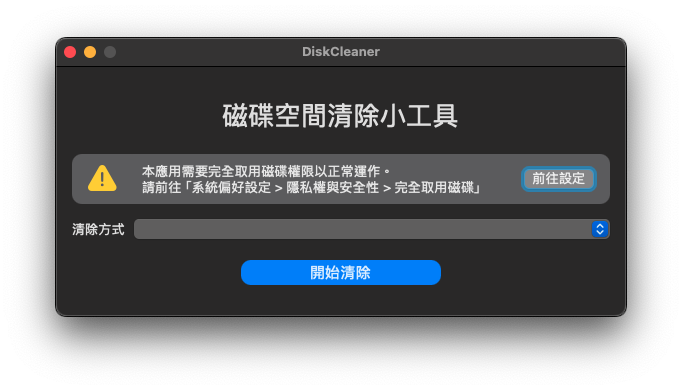
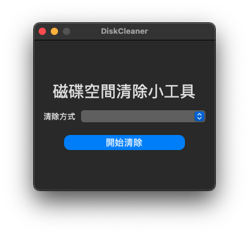
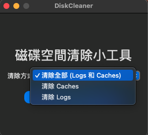

# DiskCleaner

macOS App Side Project - Disk Cleaner

用來將 Caches、Logs 等資料清除，以增加硬碟可用空間

## Developement Environment

* macOS Sonoma 14.6.1
* Xcode 16.1 beta 1
* Swift 6.0

## Minimum OS Requirement

* macOS Sonoma 14.0 or above (Compatible with Intel and Apple Silicon-based Macs)

## Screen Snapshots

### Non Full Access Disk Permissions

### Full Access Disk Permissions

### Clean mode

